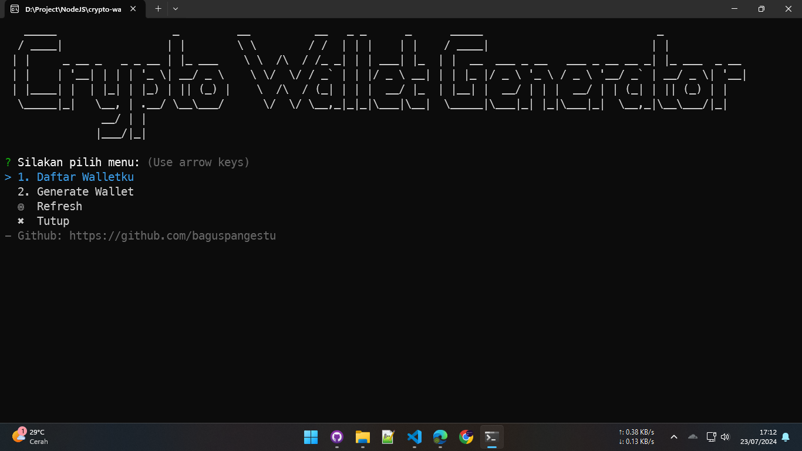
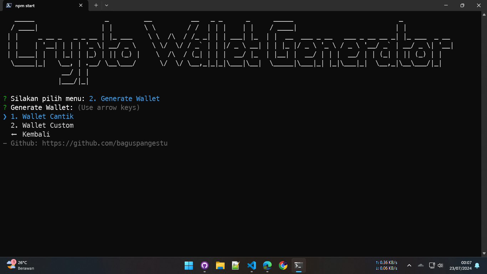
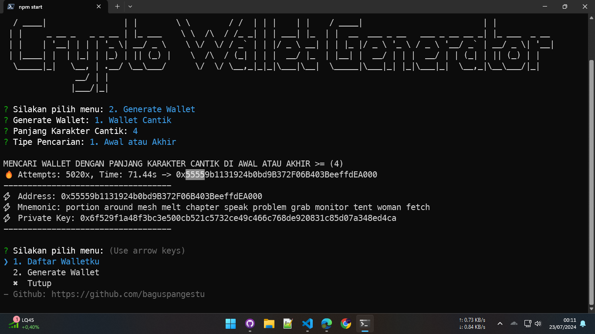
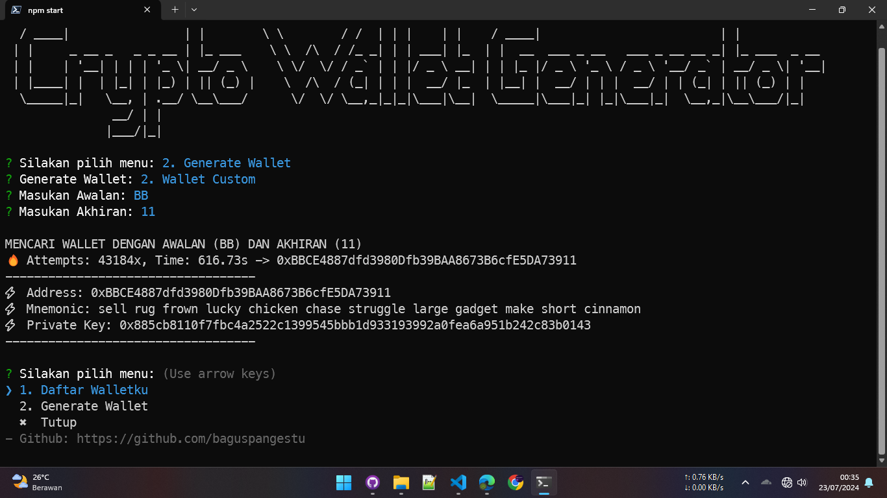
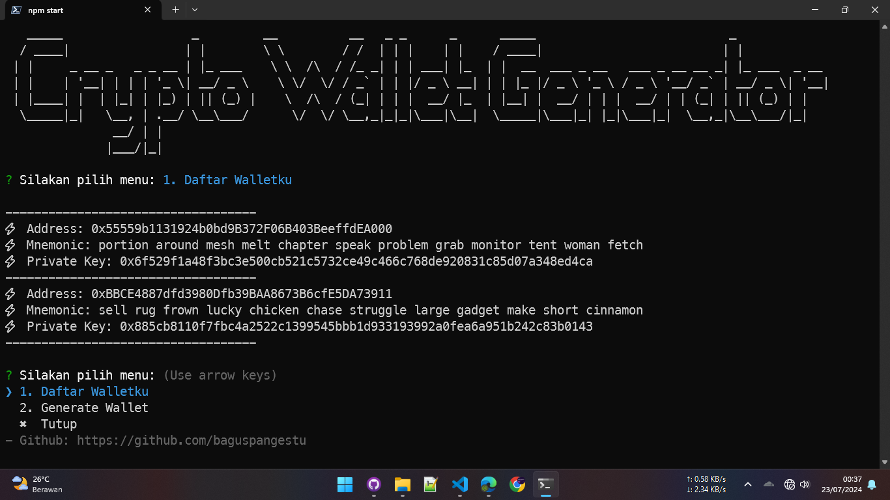
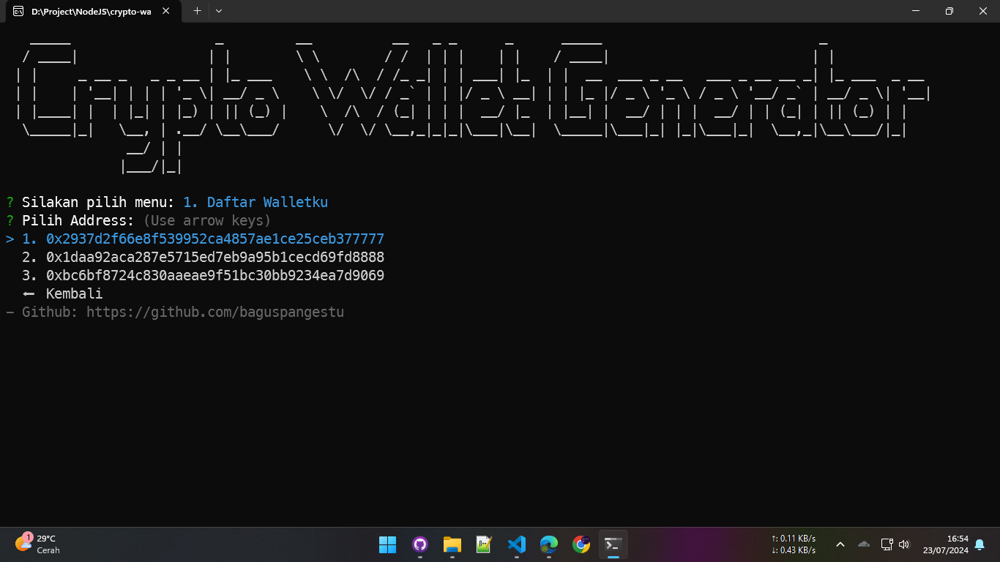
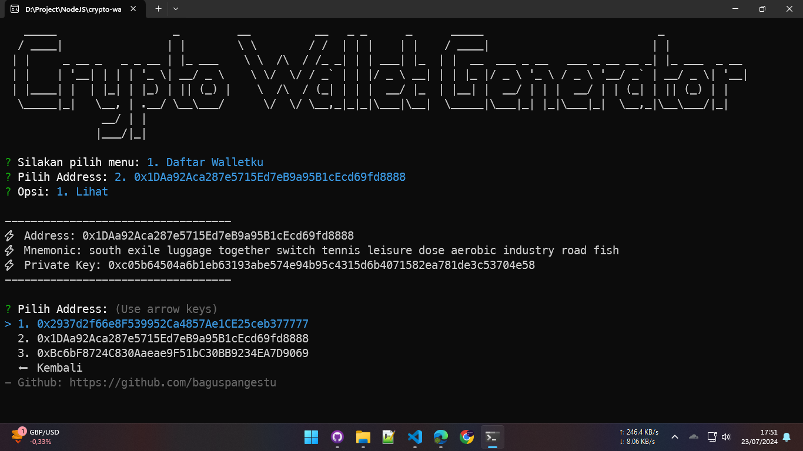

# Crypto Wallet Generator

#### Download Link

- [crypto-wallet-generator-v1.1.2-win-x64.exe](https://github.com/baguspangestu/crypto-wallet-generator/releases/download/1.1.2/crypto-wallet-generator-v1.1.2-win-x64.exe)

#### Clone Project

1. Install [Node.js](https://nodejs.org) dan [Git](https://git-scm.com/downloads)
2. Buka Terminal / CMD / Git Bash, kemudian paste.
   ```
   git clone https://github.com/baguspangestu/crypto-wallet-generator.git
   ```
3. Masuk ke direktori Project.
   ```
   cd crypto-wallet-generator
   ```
4. Install Package.
   ```
   npm install
   ```
5. Salin file .env.example menjadi .env kemudian ubah nilai SECRET_KEY pada file .env
   ```
   cp .env.example .env
   ```

## Screeenshot

### Main Menu



### Generate Wallet



#### 1. Wallet Cantik




#### 2. Wallet Custom



### Daftar Walletku




